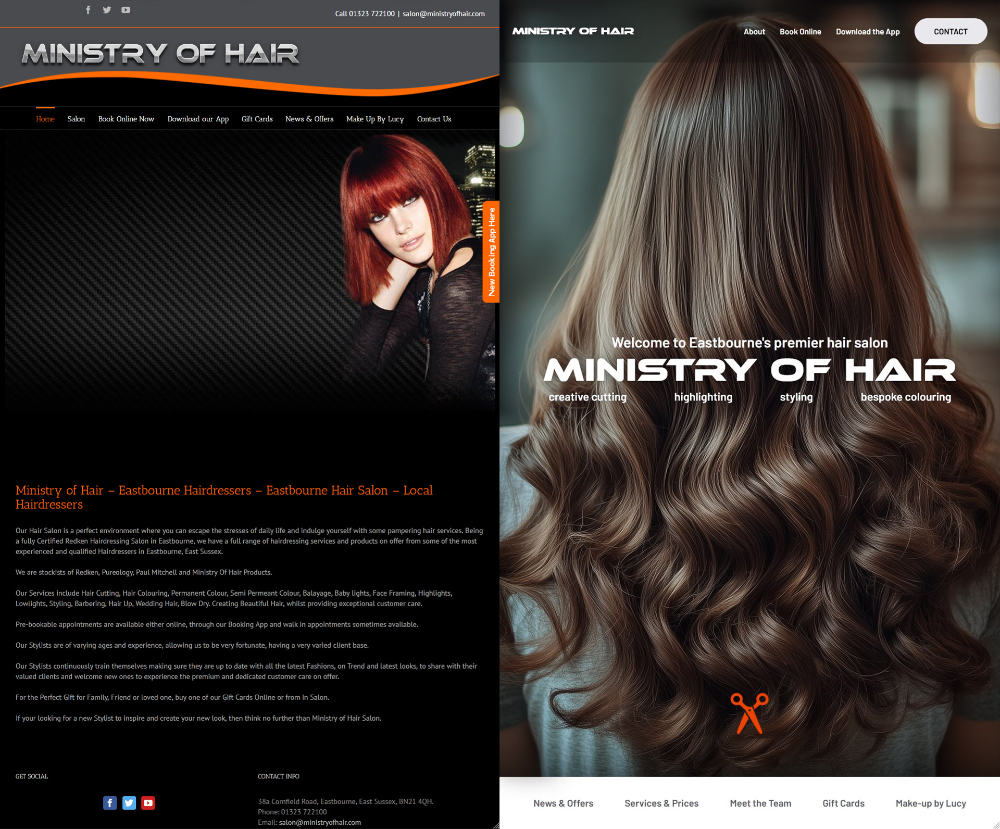

<h1>Project Overview: Redesigning the Ministry of Hair Website</h1>

This is a redesign for the hairdressers <a href="https://www.ministryofhair.com/" target="_blank">Ministry of Hair</a> located in Eastbourne, UK. I decided to take on this project because, as a local business that prides itself on providing top-notch services, their current website does not reflect the quality and modernity of their brand. The existing layout is dated, lacks visual appeal, and falls short in several key areas critical for success in today’s digital landscape.

<h4 class="blog-subtitle">Why This Redesign Was Necessary</h4>

The original website, while functional, struggled with several issues:

<ul>
    <li><strong>Outdated Design:</strong> The design is reminiscent of an older era of the web, which can deter potential clients who are looking for a contemporary, stylish salon.</li>
    <li><strong>Poor Mobile Optimization:</strong> With a significant percentage of users browsing on mobile devices, the lack of mobile responsiveness was a major drawback. The site does not scale or function properly on smaller screens, which impacts user experience and accessibility.</li>
<li><strong>Room for SEO Improvement:</strong> While the current site ranks well in local search results, there are opportunities to further enhance its SEO to attract even more potential clients and maintain its competitive edge.</li>    <li><strong>Limited User Engagement:</strong> The website’s layout and structure do not encourage interaction or exploration, leading to a potential loss of leads.</li>
</ul>

<h4 class="blog-subtitle">My Approach to the Redesign</h4>

In my redesign, I focused on creating a modern, visually appealing, and highly functional website that better represents Ministry of Hair’s brand and services. I kept their branding type and colours the same to retain their brand image and so customers still recognise Here’s how I addressed the issues:

<ul>
    <li><strong>Modern Aesthetic:</strong> I introduced a sleek, contemporary design that aligns with the salon’s brand identity. The new look is clean, elegant, and professional, helping to attract clients who value quality and style.</li>
    <li><strong>Responsive Design:</strong> The redesign ensures that the website is fully optimized for all devices. Whether viewed on a desktop, tablet, or mobile phone, the site adapts seamlessly to provide a consistent user experience.</li>
    <li><strong>Enhanced SEO:</strong> I implemented SEO best practices, including optimized meta tags, keywords, and content structure, to improve the site’s visibility in search engine results. This should help drive more organic traffic to the website.</li>
    <li><strong>Improved User Experience:</strong> I revamped the site’s navigation and layout to make it more intuitive and engaging. Clients can easily find information about services, book appointments, and learn more about the salon’s offerings.</li>
</ul>

<h4 class="blog-subtitle">Why Ministry of Hair Should Consider This Redesign</h4>

A website is often the first point of contact between a business and its potential clients. A modern, well-optimized website can significantly boost your online presence, improve customer perceptions, and drive more business. This redesign is not just about aesthetics; it’s about creating a powerful tool that will help Ministry of Hair grow and thrive in a competitive market.

With this redesign, Ministry of Hair will stand out among local competitors, attract more visitors, and convert those visitors into loyal clients. I’m confident that this updated website will not only meet but exceed the expectations of both the business and its customers.

## Contents

- [Overview](#overview)
  - [Screenshots](#screenshot)
  - [Links](#links)
- [My process](#my-process)
  - [Built with](#built-with)
  - [Continued development](#continued-development)
- [Author](#author)

## Overview

### Screenshot

### Mockup

### Comparison

### Links

- Github URL: [Github](https://github.com/Absynthee/ministry-of-hair)
- Live Site URL: [Github Pages](https://absynthee.github.io/ministry-of-hair/)

## My process

### Built with

- Semantic HTML5 markup
- CSS custom properties
- Flexbox
- CSS nesting
- Javascript
- jQuery
- Accessibility as priority

### Continued development

This redesign only includes the homepage. Continued development would span to include all pages on their website, as well as a dark theme so that users can choose between the themes to their liking.

## Author

- Web Design Agency - [KittyCode Creative](https://www.kittycodecreative.com/)
- Personal Portfolio - [Austin Spillman](https://www.austinspillman.com)
